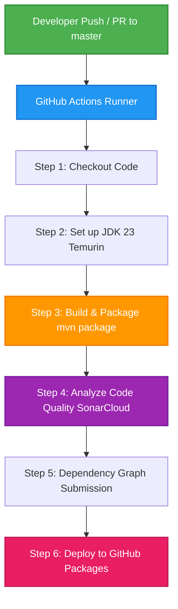

# TubesMKEPL-FIVERRR 

[](https://github.com/SIMPLIX07/TubesMKEPL-FIVERRR/actions/workflows/maven.yml)
[](https://sonarcloud.io/summary/new_code?id=SIMPLIX07_TubesMKEPL-FIVERRR)

## 1. Deskripsi Proyek & Arsitektur Pipeline CI/CD 

### Deskripsi Proyek
TubesMKEPL-FIVERRR adalah sebuah sistem simulasi platform penyedia jasa lepas (freelance market) berbasis konsol (CLI) yang terinspirasi dari Fiverr. Proyek ini dibangun menggunakan bahasa pemrograman Java dan dikembangkan sebagai bagian dari tugas mata kuliah Manajemen Kontrol Kualitas Perangkat Lunak (MKPL).

Sistem ini memfasilitasi interaksi antara tiga aktor utama:
-   Client: Dapat mengunggah lowongan pekerjaan, mencari & menyewa (hire) freelancer, memproses pembayaran transaksi, serta menulis ulasan dan memberikan rating.
-   Freelancer: Dapat melihat & melamar lowongan, memperbarui portofolio dan CV, memantau riwayat saldo, menandai status pekerjaan, serta memberikan ulasan balik untuk client.
-   Admin: Memiliki wewenang untuk melihat laporan pelanggaran pengguna, merilis pengumuman, serta melakukan tindakan administratif seperti pemblokiran (banned) pengguna yang melanggar aturan.
-   Forum: Wadah komunikasi interaktif untuk berbagi pesan antar pengguna di dalam platform.

---

### Arsitektur Pipeline CI/CD
Proyek ini mengadopsi prinsip otomatisasi modern dengan mengintegrasikan GitHub Actions sebagai orkestrator utama dalam Continuous Integration (CI) dan Continuous Delivery (CD). Pipeline secara otomatis berjalan setiap kali ada pembaruan kode pada branch master.

Berikut adalah alur arsitektur pipeline CI/CD yang berjalan:



**Detail Tahap Pipeline:**
1.  Trigger Event: Event berupa push, pull_request pada branch master, atau pembuatan tag release akan memulai workflow.
2.  Checkout Code: Mengambil kode sumber dari repositori GitHub menggunakan actions/checkout@v4.
3.  Setup Java Environment: Mengonfigurasi Java JDK 23 (Temurin distribution) dengan caching Maven diaktifkan guna mempercepat proses build di masa mendatang.
4.  Maven Build & Package: Mengompilasi source code dan mengemasnya ke dalam bentuk berkas .jar melalui perintah mvn -B package.
5.  Quality Gate & Analysis (SonarCloud): Melakukan analisis kualitas kode statis secara otomatis untuk mendeteksi kerentanan keamanan (security vulnerabilities), bugs, dan code smells melalui SonarCloud.
6.  Dependency Graph Submission: Mengirimkan informasi dependensi ke GitHub Security Advisory untuk memantau kerentanan keamanan pada library pihak ketiga.
7.  Publish Package: Mempublikasikan produk akhir (artifact JAR) ke repositori GitHub Packages secara terotomatisasi.

---

## 2. Pembagian Tugas Kelompok 👥
Pembagian tanggung jawab pengembangan komponen pipeline CI/CD berdasarkan tugas anggota kelompok:

-   Muhammad Salman Al Farizy (103022300113) - GitHub: simplix07
    -   Tahap CI/CD: Code Integration
    -   Deskripsi Kontribusi: Mengonfigurasi struktur proyek Java Maven (pom.xml), dependensi library, serta kerangka dasar alur build otomatisasi/pemicu workflow GitHub Actions.

-   Rafi Athallah Ramadhan (103022300123)
    -   Tahap CI/CD: Code Testing
    -   Deskripsi Kontribusi: Mengembangkan skenario pengujian unit (unit testing) otomatis menggunakan JUnit 5 ([ClientTest](file:///c:/Telkom/Semester%206/MKPL/TubesMKEPL-FIVERRR/src/test/java/com/mycompany/tubesfreelance/ClientTest.java)) serta mengonfigurasi perintah integrasi mvn test pada pipeline CI/CD.

-   Luthfi Rezkiansyah Ramadhani (103022300147)
    -   Tahap CI/CD: Code Inspection
    -   Deskripsi Kontribusi: Mengintegrasikan platform analisis kualitas kode statis (SAST) menggunakan SonarCloud (sonar:sonar), menyusun konfigurasi Quality Gate, serta menganalisis laporan bugs dan code smells.

-   Daffa Khairi Putra Fadli (103022300056)
    -   Tahap CI/CD: Code Deployment
    -   Deskripsi Kontribusi: Mengonfigurasi otomatisasi deployment package Maven rilis (.jar) ke GitHub Packages (mvn deploy) dan mengelola registri akses package rilis.


---

## 3. Daftar Tools & Teknologi Pipeline 
tools dan teknologi yang digunakan di setiap tahapan pipeline CI/CD:

-   Code Integration:
    -   Git & GitHub: Version Control System (VCS) untuk pengelolaan repositori kode.
    -   GitHub Actions: Platform orkestrasi untuk eksekusi workflow integrasi otomatis secara cloud.
    -   OpenJDK 23 (Temurin): Platform Java Development Kit (JDK) 23 untuk mengompilasi dan menjalankan program Java.
    -   Apache Maven: Alat otomatisasi build dan manajemen dependensi eksternal berbasis pom.xml.
-   Code Testing:
    -   JUnit Jupiter (JUnit 5): Framework penulisan skenario unit testing untuk menguji logika bisnis aplikasi.
    -   Maven Surefire Plugin (mvn test): Library Maven untuk mengeksekusi test runner dan menampilkan log hasil testing di pipeline.
-   Code Inspection:
    -   SonarCloud: Tools analisis kode statis (SAST) untuk deteksi bugs, code smells, security vulnerabilities, dan pemantauan Quality Gate.
    -   GitHub Dependency Submission Action: Membantu memindai dependensi internal proyek Maven untuk mendeteksi kerentanan keamanan (dependency vulnerability scanner).
-   Code Deployment:
    -   GitHub Packages: Package registry hosting untuk menyimpan dan mendistribusikan berkas build program (.jar).
    -   Maven Deploy Plugin (mvn deploy): Plugin Maven untuk mendistribusikan berkas JAR yang berhasil dibangun ke GitHub Packages.

---

## 4. Panduan Menjalankan Proyek Secara Lokal 

Ikuti langkah-langkah di bawah ini untuk menjalankan aplikasi dan pengujian di komputer lokal Anda.

### Prasyarat (Prerequisites)
Sebelum menjalankan proyek, pastikan perangkat Anda telah terpasang:
1.  Java Development Kit (JDK) 23 atau versi terbaru.
2.  Apache Maven (minimal versi 3.8+).
3.  Terminal atau Command Prompt (CMD/PowerShell) yang mendukung perintah dasar Maven.

### Langkah 1: Kloning Repositori
Kloning repositori proyek ini ke direktori lokal Anda:
```bash
git clone https://github.com/SIMPLIX07/TubesMKEPL-FIVERRR.git
cd TubesMKEPL-FIVERRR
```

### Langkah 2: Lakukan Build Proyek
Jalankan kompilasi proyek dan pengemasan file JAR menggunakan Maven:
```bash
mvn clean package
```
Perintah ini akan mengunduh dependensi yang diperlukan dan menghasilkan folder target yang berisi file build program.

### Langkah 3: Menjalankan Unit Test
Untuk memastikan seluruh modul berfungsi dengan baik, jalankan uji otomatisasi berikut:
```bash
mvn test
```
Hasil log eksekusi uji akan ditampilkan pada konsol Anda.

### Langkah 4: Menjalankan Aplikasi
Karena aplikasi ini berbasis konsol interaktif (CLI), jalankan perintah berikut untuk mengeksekusi kelas utama secara langsung:
```bash
mvn exec:java
```
Aplikasi akan mulai berjalan, dan Anda dapat memilih menu registrasi/login melalui konsol interaktif.
